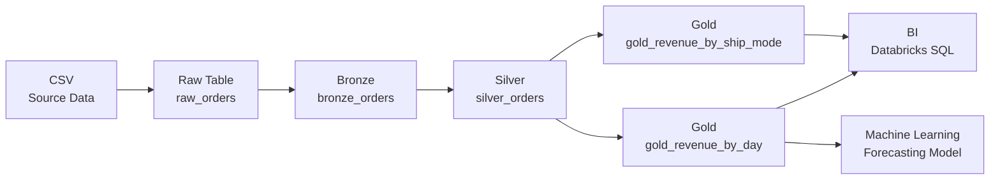
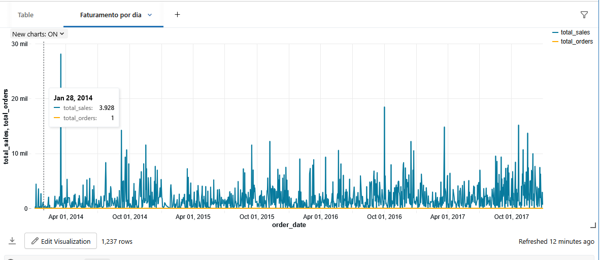
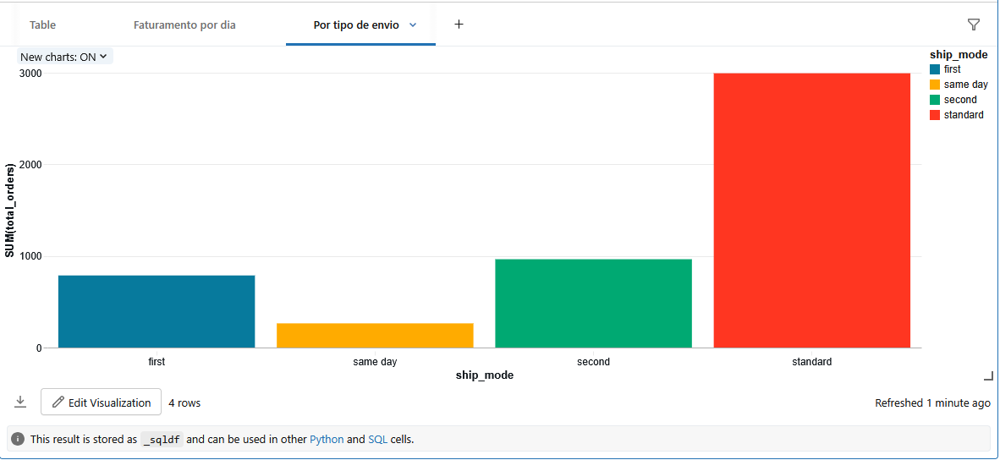

# Databricks Medallion Architecture Project

## Overview
Este projeto demonstra um pipeline de engenharia de dados utilizando a arquitetura Medallion no Databricks Community Edition, incluindo ingestão, transformação, agregação, visualização e um modelo simples de Machine Learning.

## Arquitetura
O pipeline segue as camadas:
- Raw / Landing
- Bronze
- Silver
- Gold
- BI
- ML

## Fluxo de Dados
CSV → Raw → Bronze → Silver → Gold → BI / ML

## Tecnologias Utilizadas
- Databricks Community Edition
- PySpark
- Delta Lake
- Spark SQL
- MLlib

## Camada BI
Visualizações construídas no Databricks SQL a partir da camada Gold:

- Faturamento diário
  
  
- Faturamento por modo de envio

## Machine Learning
Modelo simples de regressão linear treinado a partir da camada Gold para prever faturamento diário.
Métrica de avaliação utilizada: RMSE.

## Qualidade de Dados (Silver)
- Remoção de duplicatas
- Validação de valores nulos
- Regras de integridade de datas
- Validação de valores negativos

## Como Executar
1. Fazer upload do CSV no Databricks
2. Executar os notebooks na ordem:
   - 01_bronze_orders
   - 02_silver_orders
   - 03_gold_orders
   - 04_bi_analysis
   - 05_ml_forecasting
